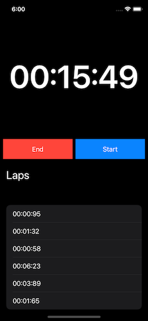

# GottaGoFast

This is a side project in which I try to make my own version of the popular running app Strava. I want to incorporate a front-end user friendly interface with a back-end database to store all information. 

I am currently using Swift and MongoDB but I think I may transition to React Native - (I did) - for the front-end as it is much more universal.

